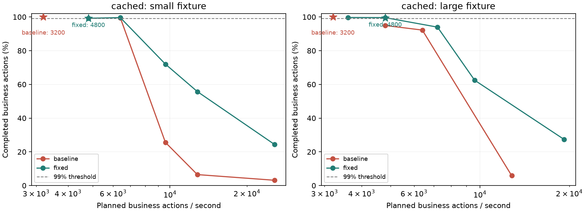
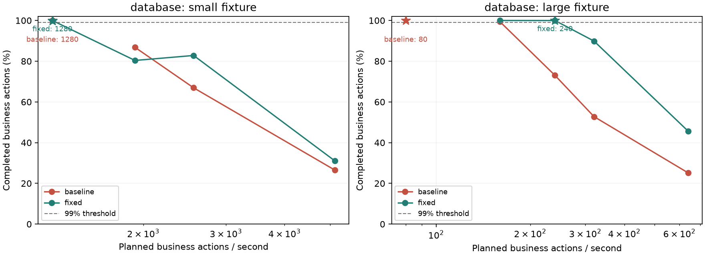
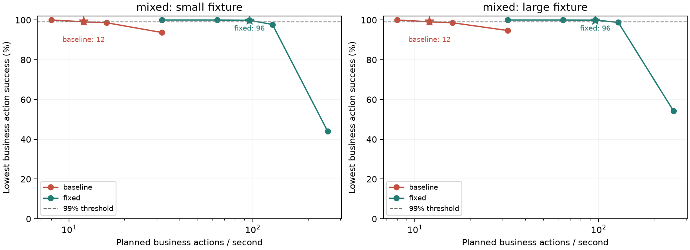
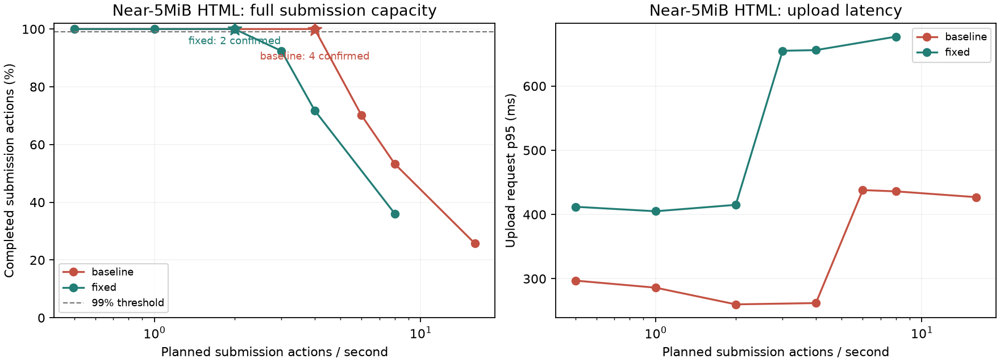
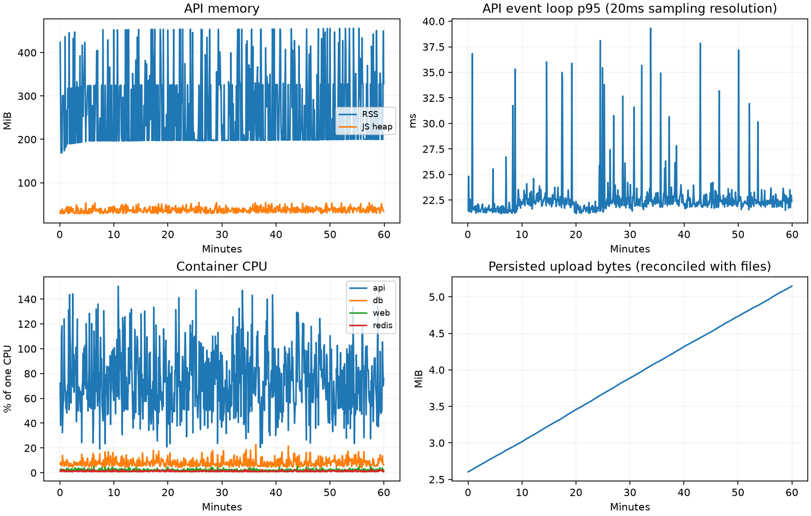
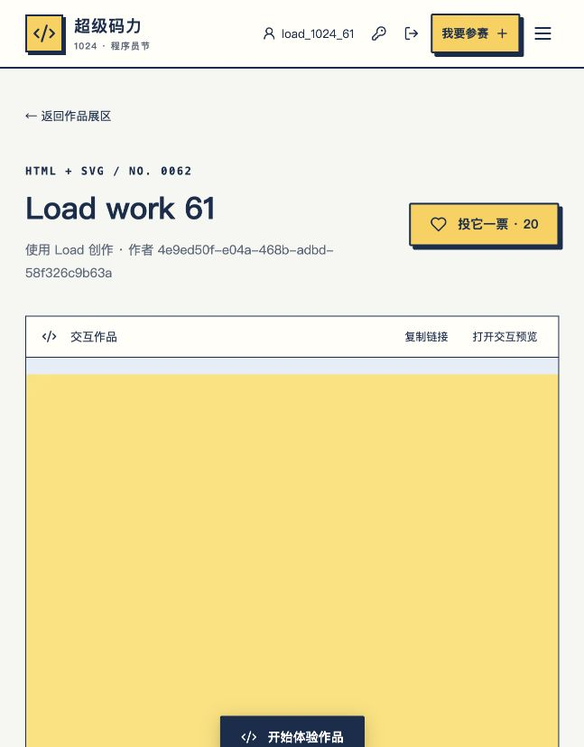

# 全面压力测试、修复与恢复验证

持续测试采样完成：2026-10-04 13:42；专用环境关闭：13:46（Asia/Shanghai）。基准提交：`2fc698a38e82bb2a95224ff4a55c5473bb25ad15`。修复代码保留在当前工作区，源码和发生器散列记录于环境清单。

## 结论与确认容量

最终 19 项完整环境功能检查、6 项故障恢复检查、TLS 和真实浏览器验收通过；50 项自动化测试及生产构建通过。60 分钟持续测试在 67.2 动作/秒下完成，所有业务分项均达标，四个容器持续运行，资源名额归零，文件、额度、归属及审计对账异常为零。

| 数据规模／场景                          | 基准确认动作/秒 | 修复后确认动作/秒 | 修复后请求/秒 | 最低业务成功率 | 修复后请求 p95                                                                  |
| --------------------------------------- | --------------: | ----------------: | ------------: | -------------: | ------------------------------------------------------------------------------- |
| 1000账号/500作品/5000票／缓存读取       |            3200 |              4800 |        4800.0 |        99.283% | read 5ms                                                                        |
| 1000账号/500作品/5000票／数据库读取     |            1280 |              1280 |        1280.0 |        99.920% | read 4ms                                                                        |
| 1000账号/500作品/5000票／混合业务       |              12 |                96 |         265.5 |        99.893% | vote 19ms、read 8ms、media 4ms、upload 14ms、write 5ms、preview 4ms、auth 456ms |
| 10000账号/5000作品/100000票／缓存读取   |            3200 |              4800 |        4799.3 |        99.525% | read 5ms                                                                        |
| 10000账号/5000作品/100000票／数据库读取 |              80 |               240 |         240.0 |       100.000% | read 7ms                                                                        |
| 10000账号/5000作品/100000票／混合业务   |              12 |                96 |         265.5 |        99.893% | vote 18ms、read 6ms、media 4ms、upload 14ms、write 5ms、preview 4ms、auth 441ms |

缓存与数据库读取动作各产生一次请求。混合业务为浏览70%、投票15%、投稿10%、认证5%，请求/秒来自实际计数。各档预热30秒、采样180秒，确认档采样300秒。表中仅采用通过全部分项SLO的确认结果。

基准总体达标的96动作/秒混合结果中，认证成功率约80%，分项验收后的基准确认值为12动作/秒。修复保持两个scrypt计算名额与原有密码强度，加入最多6项、最长1秒的认证等待队列。

大数据档4800请求/秒缓存确认曾只有94.523%完成率，已保留失败结果。相同窗口缓存命中率为99.86%，Nginx平均CPU 43.82%、峰值51.61%（一核为100%，网关预算0.5核），数据库平均CPU 1.39%。该次共75285次503、4次超时及3587个未发出动作，最大调度间隔41.3ms，执行暂停0次。结合网关CPU接近预算、缓存命中和数据库负载，瓶颈判断为网关与在途连接保护，属于基于采样指标的推断。后续3600短档通过，4800短档与两次300秒复测通过，其中干净大档完成率99.525%；7200短档为93.966%，最终确认4800，已观察的失败边界为7200。旧失败确认及资源分析保存在`previous-cache-confirmations/`和`cached-4800-resource-analysis.json`，持续运行预算取保守余量。

## 环境与默认保护

宿主为 Apple M5、arm64；Colima独立虚拟机4CPU/8GiB。API1.5CPU/1536MiB、PostgreSQL1.25CPU/1536MiB、Redis0.5CPU/384MiB、Nginx0.5CPU/192MiB。数据库连接池10，API在途32，上传2，预览8，导出1。

小档为1000账号/500作品/5000历史票，大档为10000账号/5000作品/100000历史票；历史票与当日10票额度分开，固定种子1024。容量配置提高测试IP频率和网关连接预算，保留密码成本、业务额度、在途预算和服务资源约束。默认配置的访问体验单独验证。

- 同一出口5个浏览动作/秒，基准完成率34.778%，修复后100.000%；四个独立来源全部通过，网关日志核对到四个实际源IP。
- 单次加载12张封面的独立浏览场景全部成功。普通混合业务使用一张封面及68B HTML/68B PNG，近上限投稿另行测量。
- 默认登录保护80次动作中60次成功、20次429；网关保护拒绝380次后恢复200，API IP窗口约61.0秒恢复。
- 503保护拒绝纳入动作失败；非预期5xx及超时合计要求≤0.1%。普通读取/封面/预览/写入p95≤300ms，投票≤800ms，认证≤2秒，上传≤5秒；调度延迟超过100ms的比例≤1%。

## 复现问题与修复

| 优先级 | 触发与观察                                             | 修复及回归证据                                                                                      |
| ------ | ------------------------------------------------------ | --------------------------------------------------------------------------------------------------- |
| 高     | PostgreSQL停止后基准API无法在30秒内恢复                | 空闲及借出连接错误处理、事务和游标连接释放；修复后恢复280ms，API保持运行                            |
| 高     | 缓存淘汰令100组已耗尽频率预算重新放行                  | 限流计数使用有界持久注册表；相同压力下重新放行0组，并发名额准确                                     |
| 高     | 5000层HTML导致500，写满上传卷留下部分文件              | 结构限制、独立HTML处理进程、3秒截止时间及写盘清理；复杂输入400、磁盘不足503且残留0                  |
| 高     | 导出期间并发回填记录使行数100032，预期100031           | 只读可重复读游标与独立导出名额；100031行唯一且完整                                                  |
| 中     | 共用出口IP在低业务负载即耗尽240次/分钟预算             | 默认业务IP预算2400次/分钟，封面和健康检查保留在途保护；共用出口浏览全部成功                         |
| 中     | 慢预览连接与业务共享资源；断连可提前释放处理名额       | 独立8个预览名额、断连期间保留正在处理的预算；32个连接中8个进入，其余503，结束后全部归还             |
| 中     | 每次会话访问写入活动时间，高频搜索聚合全量票数         | 会话活动最多每60秒写一次，搜索对匹配作品使用现有索引计票；两档数据库容量分别确认                    |
| 中     | 高压时上游短连接导致临时端口耗尽                       | API/封面/预览HTTP/1.1复用、共享上游活动连接预算；修复后4800档窗口TIME_WAIT峰值858，三组突发恢复通过 |
| 中     | 总体成功率掩盖集中认证失败，网关非JSON响应丢失HTTP状态 | 有界认证队列、各业务分项验收，以及读取/上传的HTTP错误提示；浏览器繁忙后恢复及自动化回归通过         |

完整HTTP/数据库检查另覆盖并发注册、会话隔离、失败登录、身份绑定、审核版本冲突、投票幂等及额度、撤回/作废竞态、预览签名、跨来源写入、分页、缓存同时重建和审计。故障检查覆盖Redis停止、数据库停止/暂停、断连后相同幂等键重试、API重启、tmpfs写满与上传中断。

## 近上限投稿、突发与持续测试

| 版本   | HTML 字节数 | 确认投稿动作/秒 | 动作成功率 | 上传 p95 |
| ------ | ----------: | --------------: | ---------: | -------: |
| 基准   |     5242780 |               4 |    99.917% |    269ms |
| 修复后 |     5242780 |               2 |   100.000% |    374ms |

投稿动作包括封面上传、HTML上传、创建作品、提交审核和管理员审核，共5次请求。对比使用相同字节数、数据规模与种子；文件大小记录在原始结果中。独立HTML进程的启动和隔离开销降低近上限文件吞吐；该代价与后台校验的读取响应、处理截止时间、进程数及上传名额边界一同交付。表中列出通过300秒复测的确认值，失败档给出容量区间的上界观察。

| 场景     | 稳定动作/秒 | 突发动作/秒 | 恢复时间 | 恢复状态   |
| -------- | ----------: | ----------: | -------: | ---------- |
| cached   |        4800 |       14400 |    316ms | [200, 200] |
| database |         240 |         720 |    338ms | [200, 200] |
| mixed    |          96 |         288 |   1147ms | [200, 200] |

每次突发持续30秒，恢复观察同时检查列表和真实登录。依赖恢复检查中Redis约1096ms、PostgreSQL约280ms、API重启约523ms，均低于30秒。

持续测试按大档混合确认容量的70%执行：67.2动作/秒、实际185.8请求/秒，预热30秒后采样3600秒。总体完成率99.998%，执行暂停0次；API实际运行覆盖3636.4秒，过期会话哨兵2→0。

| 业务动作 | 执行动作数 | 失败数 | 完成成功率 |
| -------- | ---------: | -----: | ---------: |
| browse   |     169851 |      0 |   100.000% |
| upload   |      23852 |      4 |    99.983% |
| vote     |      36161 |      0 |   100.000% |
| auth     |      12056 |      0 |   100.000% |

| 请求类别 | 请求数 |  p50 |   p95 |   p99 | 429 | 503 | 非预期5xx/超时 |
| -------- | -----: | ---: | ----: | ----: | --: | --: | -------------: |
| read     | 268868 |  3ms |   6ms |  18ms |   0 |   0 |              0 |
| media    | 169851 |  3ms |   5ms |  18ms |   0 |   0 |              0 |
| preview  |  50800 |  3ms |   5ms |   8ms |   0 |   0 |              0 |
| upload   |  47700 |  5ms |  11ms |  26ms |   0 |   4 |              0 |
| write    |  71544 |  4ms |   6ms |   9ms |   0 |   0 |              0 |
| vote     |  36161 |  4ms |  11ms |  25ms |   0 |   0 |              0 |
| auth     |  24112 | 46ms | 319ms | 449ms |   0 |   0 |              0 |

持续测试非预期5xx及超时共0次，4次上传503均为上传名额保护，已计入投稿失败。原始`examples`同时保留请求级HTTP状态与动作级异常；动作级`status=0`为兜底标记，真实超时与HTTP状态计数采用`requests.statusCodes`。

服务指标719份、资源快照720份，采集错误0份。RSS范围168.8–456.2MiB，JS堆范围28.3–54.6MiB；事件循环p95最大39.3ms（采样分辨率20ms）。数据库死锁增量0；四个容器启动时间和重启次数保持一致，OOM记录为零；停止业务后在途、上传、预览、导出及密码队列均为零。

| 采样分钟 | RSS 中位数 | JS 堆中位数 |
| -------- | ---------: | ----------: |
| 30-35    |   197.9MiB |     35.3MiB |
| 35-40    |   246.4MiB |     36.8MiB |
| 40-45    |   198.5MiB |     38.2MiB |
| 45-50    |   199.4MiB |     37.3MiB |
| 50-55    |   208.6MiB |     38.7MiB |
| 55-60    |   202.5MiB |     38.2MiB |

后半小时RSS中位数197.9–246.4MiB、JS堆35.3–38.7MiB；最后5分钟分别为202.5MiB和38.2MiB，所观察窗口未出现持续单向增长。API平均CPU为单核的74.3%（预算150%），数据库8.1%、Redis1.3%、Nginx2.2%。

文件与数据库对账：58048个文件、58048条素材记录、5400688字节；缺失、尺寸不符、孤儿文件、额度不符、超扣、错误归属、审计遗漏与重复票均为0。成功上传文件和作品历史保留，磁盘预算应按实际文件大小和投稿率计算。

## 浏览器、TLS、复现与运行建议

浏览器验收涵盖账号切换后的作品归属、预览、动画暂停/恢复、HTTP繁忙提示与恢复，以及限速上传中途取消后再次操作。截图和逐项记录见原始材料。TLS使用本地测试CA显式信任，TLSv1.3握手通过，Secure/HttpOnly/SameSite=Lax/host作用域Cookie通过；预览代理移除Cookie和Authorization，伪造来源地址被覆盖，跨来源写入403，退出后会话失效。

同资源预算和业务模型下，建议持续业务流量以本次验证的67.2混合动作/秒为起点；公网多人共用出口还受默认Nginx10请求/秒、20突发及单IP20连接保护约束。根据默认保护的429、容量保护的503、延迟、CPU、内存和磁盘增长调整预算，并在目标服务器重跑相同验收。混合业务持续测试使用68B HTML，近5MB投稿应依据2动作/秒的独立确认值预算。按70%预留余量为1.4投稿/秒，接近上限文件每小时将新增约24.6GiB；该尺寸的持续组合负载需另行复测。上传成功后的文件持续保留，应同步设置存储容量监控、告警和业务保留策略。

操作步骤见 [压力测试与恢复验证](stress-testing.md)。公开图表与统计存放于`docs/stress-assets/`，原始JSON/JSONL、日志、浏览器证据和清单存放于忽略目录`test-results/load/`，测试凭据与证书存放于`.local/load/`。专用采集器和控制器已退出，四个容器及网络已关闭，Colima `lark-load` 状态为 `Stopped`；3个测试卷与原始材料保留，记录见`final-cleanup.json`。最终环境清单为`environment-manifest-final.json`，含源码/发生器/测试脚本/实际网关配置散列、镜像ID、版本、保护配置、容器资源与端口；停止专用环境后保留复现材料。投稿、突发及持续测试的四个服务均沿用生产日志轮转，每个容器最多保留3份10MiB日志；早期容量阶段的实际日志配置保存在对应环境清单。

主要容量确认文件：`baseline-small-cached-confirm-3200.json`, `fixed-small-cached-confirm-4800.json`, `baseline-small-database-confirm.json`, `fixed-small-database-confirm-1280.json`, `baseline-quality-small-mixed-confirm.json`, `fixed-small-mixed-confirm-96.json`, `baseline-large-cached-confirm.json`, `fixed-large-cached-confirm.json`, `baseline-large-database-confirm.json`, `fixed-large-database-confirm.json`, `baseline-quality-large-mixed-confirm-12.json`, `fixed-large-mixed-confirm.json`, `baseline-maxfiles-large-upload-confirm-4.json`, `fixed-maxfiles-large-upload-confirm.json`。其他验收文件包括`fixed-final-checks.json`、`fixed-faults.json`、`tls-checks.json`、`browser-acceptance.json`、`fixed-soak-acceptance.json`、`fixed-soak-resource-summary.json`、`fixed-soak-reconciliation.json`、`final-tests.log`、`final-build.log`、`final-source-match.json`与`final-cleanup.json`。

容量适用于本机ARM虚拟化和上述预算。正式服务器的硬件、网络、公网来源分布、正式TLS证书链及备份恢复仍需部署环境验收。
